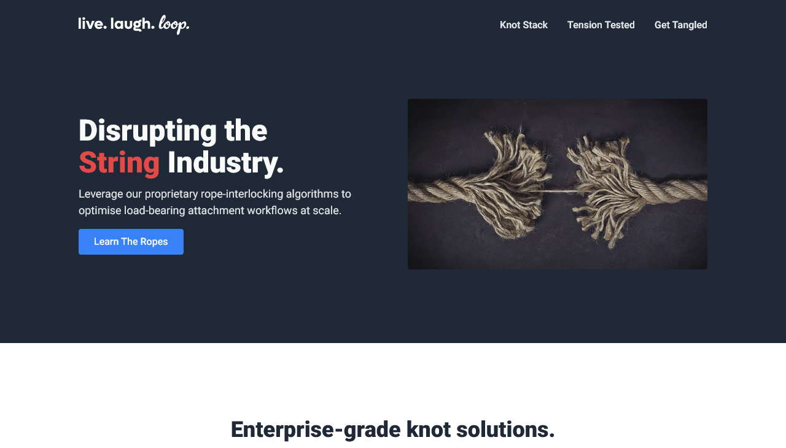
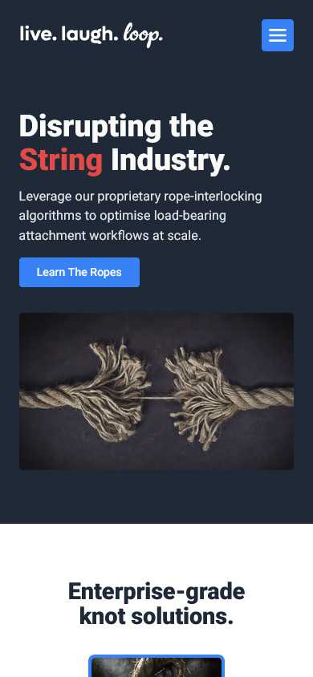

# live. laugh. loop.

A responsive landing page for a fictional Rope-as-a-Service brand, **live. laugh. loop.**, built for the second CSS project in [The Odin Project Foundations course](https://www.theodinproject.com/).

🔗 **[Live demo](https://cliop.github.io/landing-page/)**

<p align="center">
  
  
</p>

## About

The brief provides a simple desktop landing page mockup and a small colour and font reference. I decided to use the assignment as a controlled practice project rather than only recreating the page at minimum scope. The goal was to stay close to the provided design while practising the kinds of decisions that come up when translating an existing design into a working site: responsive behaviour, accessible interactions, deliberate deviations where the mockup was incomplete, and a small amount of vanilla JavaScript.

This is a static learning project, not a production website. It builds on patterns from an [earlier Foundations project](https://github.com/ClioP/odin-recipes) but is intended to stand on its own.

### Approach

The mindset for this project was different from a more open-ended one. The mockup was provided, so any deviations needed clear reasons. I planned the work in phases: HTML structure first, then CSS, then responsive behaviour, then JavaScript, then a final accessibility pass, and tried to let the rendered page lead the system rather than the other way around.

That principle did not survive the first attempt.

## The reset

The original approach went too broad too quickly. I started building a CSS foundation (layers, tokens, typography scale) before the HTML existed. The architecture grew faster than the page did, and the two became disconnected.

Process problems compounded. I was getting stuck in dead ends, kept forgetting to commit at meaningful checkpoints and the work blurred into one long unstructured session. My drive collapsed; I felt like I was following a checklist I did not understand, and I stopped learning.

I deleted the repository, kept the written code as a backup, and started over. The new workflow was simpler:

> Build one segment. Resolve it. Commit. Move on.

The technical output of this project did not change much because of the reset. The process did. Working in small, finished increments meant each decision was grounded in a real rendered problem, each commit reflected a real change, and the project regained shape. The reset was the most useful lesson the project produced, even though it was not a technical one.

## Project goals

A few specific goals shaped the technical work.

**Translating a provided design into code.**
Working from a fixed mockup is a common real-world scenario, and one I had not practised deliberately from scratch before. The challenge was less about invention and more about restraint, accuracy, and decision-making within an existing design.

**A three-tier colour system.**
The brief provides colours in HEX, but I wanted to work in OKLCH for derivation and relative colour syntax. The system has three layers: HEX primitives that preserve the assignment values, an OKLCH working palette derived from those primitives, and semantic tokens layered on top. More tokens than a smaller project would need, but the structure made sense.

**Refining the cascade layer structure.**
I started with a common layer order (`reset, theme, elements, components, utilities`) but the `elements` layer became overloaded almost immediately. It was holding both raw element styling and layout patterns. I split it into `base`, `elements`, and `layout` after seeing the problem in the rendered code. The split is unusual, but it made the system easier to reason about for me, even if it is not standard.

**Comparing two different interaction patterns: modal behaviour and a disclosure mobile nav.**
My previous project used a mobile nav that mixed disclosure and modal behaviour without committing to either. This time I decided to split them. The mobile nav is a clean disclosure pattern (the menu opens as a panel below the header and remains part of the page's normal flow), and the CTA opens a native `<dialog>` modal. Implementing both in one project let me see the differences in JavaScript handling directly.

**Notes-driven documentation.**
I kept process notes from the start, which meant this README was written from notes rather than reconstructed from memory. This made the documentation feel intentional rather than retrospective, and gave me material to revisit when I return to the project later.

## Deliberate deviations from the brief

The mockup is incomplete in places and visually inconsistent in others. Each deviation has a reason.

- **SVG logo asset** instead of typed placeholder text. A logo built from rendered HTML text is fragile. Font substitution or load failure can change the brand mark. An SVG locks the identity.
- **Stronger nav styling.** The original mockup's navigation reads closer to secondary links than primary navigation. Spacing, weight, and interaction states turn it into a clear menu.
- **Feature card hierarchy.** The original uses flat caption-style text under each image. Real landing-page feature cards use a title and supporting text.
- **Complementary colour added to the palette.** The provided palette does not cover every interaction and emphasis needs. A complementary colour was derived from the accent using OKLCH relative colour syntax.
- **Spacing system.** The mockup spacing is visually inconsistent. I took measurements in Photoshop, then consolidated similar values into a smaller, more deliberate spacing scale rather than copying every measured pixel.
- **Responsive behaviour and mobile navigation.** The brief does not require either, but they are practical fundamentals worth working on.
- **Custom 404 page.** The hero CTA needed somewhere to go. Linking it to the existing modal would have duplicated the bottom CTA's behaviour, and building a full content page was beyond scope. A 404 page was the most logical destination.

## Challenges

These were the technical problems that took the most thought to solve. Each one taught me something about how the layers of a project interact.

### Mobile navigation accessibility

The disclosure pattern hides the closed menu visually with `max-height: 0` and `overflow: hidden`. Visually that works. The keyboard story is worse: visual hiding does not remove links from the tab order, so a keyboard user could still focus invisible nav links inside a clipped container.

The fix was the `inert` attribute, applied to the nav element when closed and scoped to mobile via `matchMedia`. On desktop the nav stays interactive regardless of `aria-expanded`; below the breakpoint, `inert` removes the closed menu from the tab order entirely. The fix was added late, after the menu was otherwise complete, and served as a reminder that visual completion and accessible completion are not the same.

### Escape key handling

Two separate behaviours were wanted: Escape closes the mobile menu, and Escape removes focus from the currently focused element generally. Both registered as document-level `keydown` listeners.

The conflict was not obvious until I tested it: pressing Escape with the menu open closed the menu _and_ blurred the toggle button on the same keypress. The user lost their focus context entirely. The fix was `event.stopImmediatePropagation()` in the menu's Escape handler, so the global blur handler does not fire when the menu has already handled the keypress.

### Modal interactions

Native `<dialog>` provides focus management, the backdrop, and Escape-to-close by default. Most of the work was deciding what to layer on top of the native behaviour.

**The decisions:**

- **Where focus lands when the modal opens.** The dialog itself receives focus, neither button highlighted. The close button felt like a destructive behaviour for a default, and the link button leads outside the site, so neither was a safe automatic focus target. Letting the user choose what to do first was the cleaner default.
- **How backdrop clicks are detected.** A click on the backdrop registers as a click on the `<dialog>` element itself, while clicks inside the dialog content register as the inner element. Comparing `event.target` to the dialog gives a clean "clicked outside content" check.
- **What closes the dialog.** Close button, backdrop click, link click (the link leaves the site, so closing on click prevents an open dialog from staying behind a new tab), and Escape via the native handler.

### Three-tier colour system

The structure has more tokens than a simpler project would need, and explaining the layers takes effort. The trade-off was wanting an OKLCH workflow without losing the assignment's source values:

```css
/* 1. Primitive assignment colours in HEX */
--hex-accent: #3882f6;

/* 2. Working palette: OKLCH-normalised / derived */
--palette-accent: oklch(from var(--hex-accent) l c h);
--palette-complementary: oklch(from var(--hex-accent) l c 25);

/* 3. Semantic colour tokens */
--color-bg-accent: var(--palette-accent);
--color-text-on-accent: var(--palette-secondary);
```

The HEX primitives stay as the brief provided them. The working palette converts them to OKLCH and derives related colours. The semantic layer is what components actually use. Changing a colour at the brief level propagates through the entire system, but the layers can also be considered independently.

## Accessibility

Accessibility work happened throughout the project rather than as a separate pass at the end. What this looked like:

- Skip link to `#main` as the first focusable element
- `:focus-visible` for keyboard focus styles
- `aria-controls`, `aria-expanded`, and visually hidden text on the mobile nav toggle
- `aria-haspopup="dialog"` on the modal trigger
- `aria-labelledby` on the dialog
- Decorative SVGs marked with `aria-hidden="true"` and `focusable="false"`
- `inert` to remove the closed mobile nav from the tab order
- Escape-key handling for dismissible UI
- `prefers-reduced-motion` support

Most of these are standard practice rather than novel work. They are listed because considering them throughout the build was a deliberate choice, even when the individual implementations are routine.

The project was tested with keyboard navigation but not with screen readers or automated tools. Some contrast pairings (white text on the light blue background, for example) follow the assignment's specified colour usage rather than verified WCAG ratios. The accessibility work reflects considered intent within the constraints of the brief, not verified compliance.

## Tech stack

- HTML
- CSS
- Vanilla JavaScript
- GitHub Pages

No framework, no build step, no package dependencies.

## Known limitations

- Static learning project, not a production website.
- The hero CTA intentionally links to the 404 page.
- Header and footer markup is duplicated across pages. No templating, includes, or build tools.
- The modal is a confirmation interaction, not a real signup flow.
- Modern browsers only; no legacy browser support.
- Accessibility has not been screen-reader tested or run through automated tools.

## Final thoughts

The reset was the most useful thing the project produced; more useful than any individual technical decision. Build first, systemise second is a principle I had come across before, but had not internalised. Living through the failure mode of doing it backwards made the principle real.

The other lesson was about restraint. A defined brief is a different challenge from an open one. Knowing when _not_ to add something (when the mockup is enough, when the existing system covers the case, when a deviation needs to be justified before it earns its place) is its own skill.

I expect to revisit this project after I have built a few more, both to see what I would do differently and to apply what I will have learned by then.

## Acknowledgments

The original brief comes from [The Odin Project's Foundations Landing Page project](https://www.theodinproject.com/lessons/foundations-landing-page). The expanded concept, copywriting, design decisions, responsive behaviour, and implementation choices are my own.

The modal links to an article about cordage from [Royal Museums Greenwich](https://www.rmg.co.uk/stories/maritime-history/cordage-its-origins-construction-properties-uses-ships).
